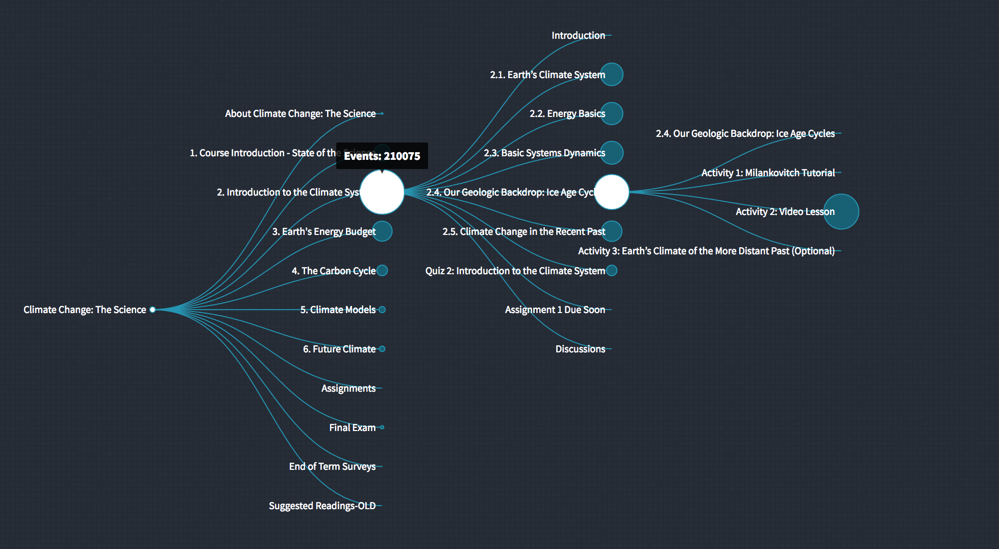
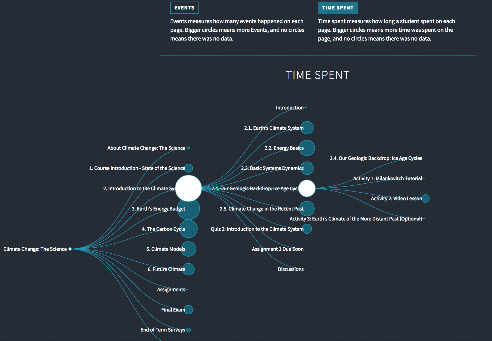

# Course Tree 
Interactive visualization of the structure and student engagement with an online MOOC [Climate Change: The Science](https://courses.edx.org/courses/course-v1:UBCx+Climate1x+3T2016/info)

# Screenshots

## Presentation Slides
[Hackathon Presentation Slides](https://docs.google.com/presentation/d/1pwCJ0FmwoqJyCwhgLZJ76ES6J6hiYBkBfFfsHJmhb8k/edit?usp=sharing)

## License
Released under the [GNU General Public License, version 3](https://opensource.org/licenses/GPL-3.0)
